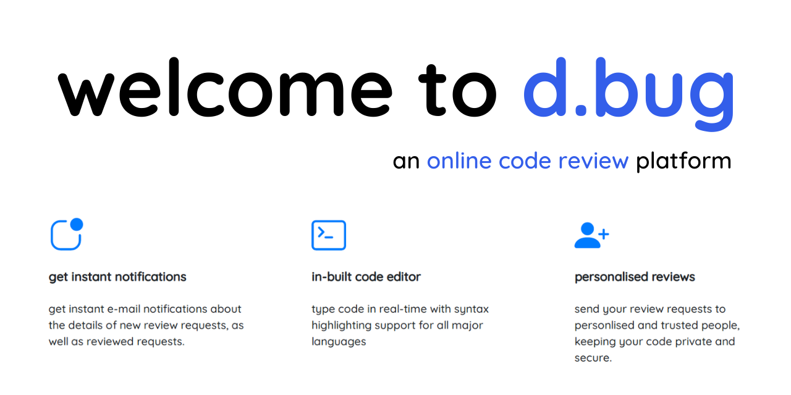

# dbug
 

**d.bug** is an online code review platform where users can request
other users to review their code and provide useful feedback/changes.

The key features provided by the d.bug platform are -  
- **get instant notifications**: reviewers and reviewees get instant e-mail notifications whenever a new request is generated, or a request is reviewed. 
- **in-built code editor**: type code in real-time with syntax highlighting for all major languages. User has the ability to choose from a wide variety of light and dark themes.
- **personalised reviews**: send review requests to personlised and trusted people, keeping your code private and secure.  

---

The application can also be found online at ***[d-bug.herokuapp.com](https://d-bug.herokuapp.com)***    
To run the Django application on localhost, the dependencies can be found in `requirements.txt`

---

This project was completed as part of the Capstone Project at 
NIIT University by  **[Aaryamann Sharma](https://github.com/Aaryamann171)** and **[Akshit Sarin](https://github.com/akshitsarin)**  
